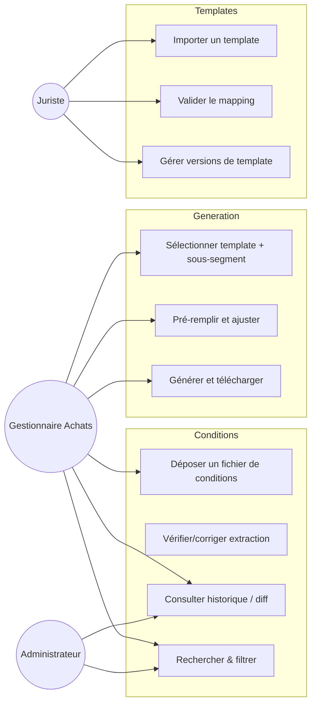
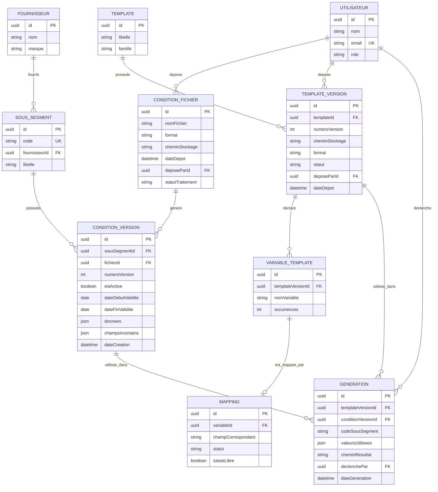
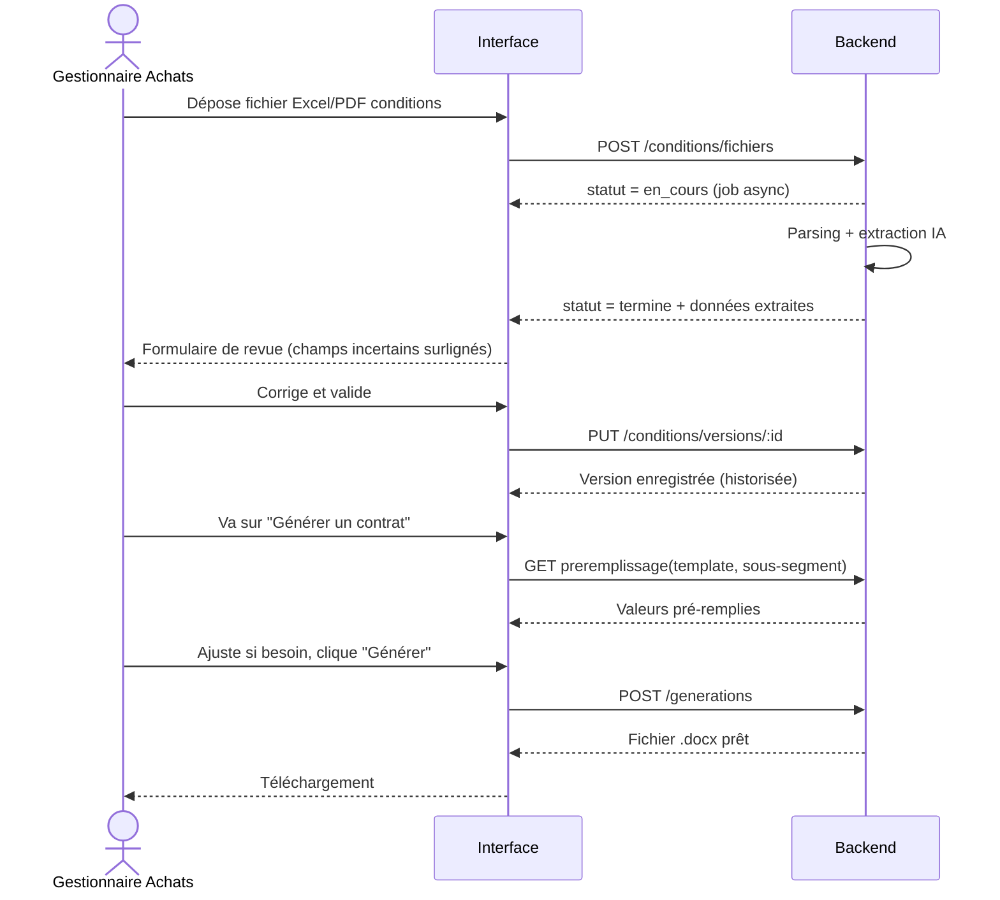

# Cahier des charges — Gestion des conditions commerciales & génération automatique de contrats

> Document de cadrage fonctionnel et technique, prêt à être transmis à une équipe
> de développement ou à un outil de génération d'application IA.
> Il décrit la **cible (V2)** de l'application, en s'appuyant sur l'existant du
> dépôt (`README.md`, `server/`, `client/` — ci-après « V1 ») qui couvre déjà une
> partie du périmètre (dépôt Excel/Word, mapping, génération `.docx`) mais sans
> lecture PDF/OCR, sans IA d'extraction, et avec un stockage fichier JSON plutôt
> qu'une base de données relationnelle.

---

## Sommaire

1. [Vision globale](#1-vision-globale)
2. [Analyse fonctionnelle](#2-analyse-fonctionnelle)
3. [Architecture technique](#3-architecture-technique)
4. [Modèle de données](#4-modèle-de-données)
5. [Schéma de base de données](#5-schéma-de-base-de-données)
6. [API](#6-api)
7. [Interfaces utilisateur](#7-interfaces-utilisateur)
8. [Flux métier](#8-flux-métier)
9. [Sécurité](#9-sécurité)
10. [Gestion des versions](#10-gestion-des-versions)
11. [Plan de développement détaillé](#11-plan-de-développement-détaillé)
12. [Recommandations techniques et bonnes pratiques](#12-recommandations-techniques-et-bonnes-pratiques)

---

## 1. Vision globale

### 1.1 Problème adressé

Les équipes Achats reçoivent des conditions commerciales fournisseurs sous des
formats hétérogènes (Excel, Word, PDF, mails scannés) et doivent ensuite
produire des contrats en recopiant manuellement ces informations dans des
modèles Word. Ce processus est :

- **lent** (ressaisie manuelle, recherche de la bonne version) ;
- **source d'erreurs** (copier-coller, oubli de variable, valeur périmée) ;
- **peu traçable** (pas d'historique fiable de « qui a changé quoi, quand ») ;
- **difficile à auditer** (impossible de savoir quelle version de conditions a
  servi à générer tel contrat).

### 1.2 Objectif produit

Une application web interne qui :

1. **Centralise et historise** les conditions commerciales par fournisseur /
   sous-segment, avec extraction automatique des données depuis les fichiers
   sources (Excel, Word, PDF, scan).
2. **Cartographie automatiquement** les variables `{{Variable}}` des modèles
   de contrat importés, avec validation humaine du mapping.
3. **Génère automatiquement** le contrat final en combinant un template et les
   conditions commerciales d'un sous-segment donné, prêt à télécharger.

### 1.3 Principes directeurs

- **Rien n'est jamais écrasé** : chaque dépôt de fichier crée une nouvelle
  version horodatée ; l'historique complet reste consultable.
- **L'automatique propose, l'humain valide** : l'extraction et le mapping sont
  faits automatiquement mais restent éditables avant validation.
- **Traçabilité de bout en bout** : chaque contrat généré référence précisément
  la version du template et la version des conditions utilisées.
- **Autonomie de déploiement** : l'application doit pouvoir tourner en interne
  sans dépendance à un service cloud tiers obligatoire (cf. V1, exécutable
  Windows autonome), tout en restant compatible avec un déploiement serveur
  classique.

### 1.4 Utilisateurs cibles

| Rôle | Besoin principal |
|---|---|
| Gestionnaire Achats / Category Manager | Déposer les conditions commerciales, consulter l'historique, générer des contrats |
| Juriste / Contract Manager | Déposer et faire évoluer les modèles de contrat, valider le mapping des variables |
| Administrateur applicatif | Gérer les utilisateurs/droits, superviser les imports en échec, purger/archiver |
| Auditeur (lecture seule) | Consulter l'historique des conditions et des contrats générés |

---

## 2. Analyse fonctionnelle

### 2.1 Périmètre fonctionnel — Module 1 : Conditions commerciales

**Fonctions :**

- Dépôt d'un fichier (Excel `.xlsx`, Word `.docx`, PDF, image scannée) contenant
  des conditions commerciales pour un ou plusieurs sous-segments.
- Analyse automatique du fichier → extraction structurée (voir §8.2) →
  proposition d'un jeu de données (une ligne = un sous-segment + ses attributs).
- Écran de vérification/correction des données extraites avant validation
  (l'IA peut se tromper ; l'utilisateur corrige et valide).
- Persistance en base : chaque sous-segment reçoit une nouvelle **version** de
  conditions ; l'ancienne version reste consultable mais n'est plus « active ».
- Consultation de l'historique complet d'un sous-segment (diff visuel entre
  deux versions : valeurs ajoutées/modifiées/supprimées).
- Recherche/filtrage multi-critères : fournisseur, marque, sous-segment,
  période de validité, statut (active/historisée/expirée), dépose-par.

**Règles de gestion :**

- RG1 — Un sous-segment est identifié par un **code unique** (`codeSousSegment`).
  Deux enregistrements ne peuvent pas partager le même code **et** la même
  période de validité active.
- RG2 — Le dépôt d'un nouveau fichier ne supprime jamais l'ancien : il crée une
  nouvelle version liée au(x) même(s) sous-segment(s) si le code correspond, ou
  de nouveaux sous-segments sinon.
- RG3 — Une seule version par sous-segment peut être **active** à un instant T
  (celle utilisée par défaut pour la génération de contrat) ; l'activation
  d'une version désactive automatiquement la précédente.
- RG4 — Si l'extraction automatique ne peut pas déterminer une valeur avec
  confiance suffisante, le champ est marqué « à vérifier » et bloque la
  validation tant qu'il n'est pas renseigné manuellement.

**Données extraites (dictionnaire métier) :**

| Champ | Exemple | Obligatoire |
|---|---|---|
| Code sous-segment | `SSG-2026-014` | oui |
| Fournisseur | `ABC Distribution` | oui |
| Marque | `ABC` | non |
| Conditions tarifaires | `Tarif net 12,50€/unité` | non |
| Remises | `15%` / paliers de remise | non |
| Conditions logistiques | `Franco de port dès 500€` | non |
| Conditions de paiement | `60 jours fin de mois` | non |
| Date début validité | `2026-01-01` | oui |
| Date fin validité | `2026-12-31` | non |
| Autres informations commerciales | libre (JSON clé/valeur) | non |

### 2.2 Périmètre fonctionnel — Module 2 : Templates de contrat

**Fonctions :**

- Import d'un modèle de contrat (`.docx` ou `.pdf`).
- Détection automatique de toutes les variables `{{NomVariable}}` présentes
  dans le corps du document (voir §8.3 pour le mécanisme technique).
- Génération automatique d'une **proposition de mapping** : chaque variable
  détectée est rapprochée par similarité de nom d'un champ du dictionnaire
  métier des conditions commerciales (ex. `{{NomFournisseur}}` → `fournisseur`).
- Écran de mapping où l'utilisateur peut : valider une correspondance,
  la modifier (choisir un autre champ), la laisser en « saisie libre »
  (valeur demandée manuellement à chaque génération), ou la marquer
  « non utilisée ».
- Enregistrement du template + son mapping comme une **version** ; toute
  ré-importation du même modèle logique (même nom/famille) crée une nouvelle
  version sans supprimer les précédentes (traçabilité des contrats déjà
  générés avec l'ancienne version).

**Règles de gestion :**

- RG5 — Une variable non mappée et non marquée « saisie libre » empêche la
  validation du template (statut `manquante`).
- RG6 — Le format de variable reconnu est `{{NomVariable}}` (espaces internes
  tolérés : `{{ NomVariable }}`), insensible à la casse pour le rapprochement
  automatique mais restitué tel quel dans le contrat généré.
- RG7 — Un template a un statut : `brouillon` (mapping incomplet), `validé`
  (prêt à générer), `archivé` (remplacé par une version plus récente ou retiré
  manuellement).

### 2.3 Périmètre fonctionnel — Module 3 : Génération de contrat

**Fonctions :**

- Sélection d'un template validé (+ sa version, par défaut la dernière).
- Sélection d'un code sous-segment → l'application propose la version active
  des conditions commerciales correspondantes (avec possibilité de choisir une
  version historique si besoin, cas d'usage « régénérer un contrat passé »).
- Pré-remplissage automatique d'un formulaire avec toutes les variables du
  mapping ; les champs « saisie libre » restent vides et éditables ; tous les
  champs restent modifiables avant génération finale.
- Génération du document final (`.docx` et/ou export `.pdf`) avec remplacement
  des variables **sans altérer la mise en forme** du template.
- Téléchargement du contrat, et conservation en base de l'enregistrement de
  génération (référence template+version, conditions+version, valeurs
  utilisées, utilisateur, date).
- Historique des contrats générés, avec possibilité de re-télécharger un
  contrat déjà produit ou de le régénérer à l'identique.

**Règles de gestion :**

- RG8 — Une génération échoue explicitement (avec message clair) si une
  variable obligatoire n'a pas de valeur au moment de la génération.
- RG9 — Le contrat généré est immuable une fois produit : toute correction
  nécessite une nouvelle génération (nouvelle entrée d'historique), jamais une
  modification du fichier déjà généré.

### 2.4 Cas d'usage (synthèse)



---

## 3. Architecture technique

### 3.1 Vue en couches

```mermaid
flowchart TB
    subgraph Client["Frontend (SPA React)"]
        UI1[Écran Conditions]
        UI2[Écran Templates]
        UI3[Écran Génération]
    end

    subgraph API["Backend API (Node.js / Express, REST)"]
        R1[/conditions/]
        R2[/templates/]
        R3[/generations/]
        AUTH[Middleware Auth/RBAC]
    end

    subgraph Domain["Services métier"]
        S1[ConditionsService]
        S2[TemplatesService]
        S3[GenerationService]
        S4[ExtractionService\n(parsing + IA)]
        S5[MappingService]
    end

    subgraph Infra["Infrastructure"]
        DB[(Base de données\nrelationnelle)]
        FS[(Stockage fichiers\nlocal / S3-compatible)]
        OCR[Moteur OCR]
        LLM[Service IA d'extraction\n(LLM)]
        QUEUE[File de traitement asynchrone\n(imports volumineux)]
    end

    Client -->|HTTPS / JSON| API
    API --> AUTH
    API --> S1 & S2 & S3
    S1 --> S4
    S2 --> S4
    S4 --> OCR
    S4 --> LLM
    S1 & S2 & S3 --> DB
    S1 & S2 --> FS
    S4 --> QUEUE
```

### 3.2 Découpage en services

- **ConditionsService** : cycle de vie des fichiers de conditions et de leurs
  versions ; orchestration de l'extraction.
- **TemplatesService** : cycle de vie des templates, détection des variables,
  gestion des versions.
- **MappingService** : rapprochement variable ↔ champ métier (règles +
  suggestion IA), CRUD du mapping.
- **GenerationService** : assemblage template + données, remplacement des
  variables, production du document final.
- **ExtractionService** : pipeline commun de lecture de fichier (Excel/Word/PDF/
  image) → texte/tableaux structurés → **extraction IA** → objet métier
  structuré et scoré (confiance par champ).
- **StorageService** : abstraction de stockage binaire (disque local en V1,
  compatible S3/MinIO en cible pour un déploiement serveur mutualisé).

### 3.3 Communication

- API REST JSON (voir §6), authentifiée par session/JWT.
- Traitement asynchrone (file de jobs) pour les imports volumineux ou l'OCR,
  avec statut consultable (`en cours`, `terminé`, `échec`) et notification côté
  UI (polling léger ou WebSocket/SSE).

### 3.4 Déploiement

Deux profils supportés, dans la continuité de la V1 :

1. **Poste de travail / petite équipe** : exécutable autonome embarquant
   Node.js + base de données fichier (SQLite) + stockage disque local — sans
   dépendance réseau, sans IA cloud (extraction par règles/heuristiques
   uniquement, IA optionnelle si une clé d'API est configurée).
2. **Serveur mutualisé / cloud interne** : conteneur Docker, base PostgreSQL
   managée, stockage objet (S3/MinIO), service IA/OCR externe (API), plusieurs
   instances derrière un reverse proxy.

---

## 4. Modèle de données

### 4.1 Entités principales



### 4.2 Dictionnaire de champs métier (référentiel d'extraction)

Ce référentiel sert à la fois de schéma cible pour l'IA d'extraction (§8.2) et
de source de suggestions pour le mapping des variables (§2.2) :

`codeSousSegment`, `fournisseur`, `marque`, `conditionsTarifaires`,
`remises`, `dateDebutValidite`, `dateFinValidite`, `conditionsLogistiques`,
`conditionsPaiement`, `autresConditions` (objet clé/valeur libre).

---

## 5. Schéma de base de données

Schéma relationnel cible (PostgreSQL en déploiement serveur ; SQLite en mode
autonome — DDL compatible aux types near-identiques près) :

```sql
CREATE TABLE utilisateur (
  id              UUID PRIMARY KEY DEFAULT gen_random_uuid(),
  nom             TEXT NOT NULL,
  email           TEXT UNIQUE NOT NULL,
  role            TEXT NOT NULL CHECK (role IN ('gestionnaire','juriste','admin','auditeur')),
  cree_le         TIMESTAMPTZ NOT NULL DEFAULT now()
);

CREATE TABLE fournisseur (
  id              UUID PRIMARY KEY DEFAULT gen_random_uuid(),
  nom             TEXT NOT NULL,
  marque          TEXT
);

CREATE TABLE sous_segment (
  id              UUID PRIMARY KEY DEFAULT gen_random_uuid(),
  code            TEXT UNIQUE NOT NULL,
  fournisseur_id  UUID REFERENCES fournisseur(id),
  libelle         TEXT
);

CREATE TABLE condition_fichier (
  id                  UUID PRIMARY KEY DEFAULT gen_random_uuid(),
  nom_fichier         TEXT NOT NULL,
  format              TEXT NOT NULL CHECK (format IN ('xlsx','docx','pdf','image')),
  chemin_stockage     TEXT NOT NULL,
  date_depot          TIMESTAMPTZ NOT NULL DEFAULT now(),
  depose_par_id       UUID REFERENCES utilisateur(id),
  statut_traitement   TEXT NOT NULL DEFAULT 'en_attente'
                        CHECK (statut_traitement IN ('en_attente','en_cours','termine','echec'))
);

CREATE TABLE condition_version (
  id                    UUID PRIMARY KEY DEFAULT gen_random_uuid(),
  sous_segment_id       UUID NOT NULL REFERENCES sous_segment(id),
  fichier_id            UUID NOT NULL REFERENCES condition_fichier(id),
  numero_version        INT NOT NULL,
  est_active            BOOLEAN NOT NULL DEFAULT false,
  date_debut_validite   DATE,
  date_fin_validite     DATE,
  donnees               JSONB NOT NULL,       -- dictionnaire de champs métier (§4.2)
  champs_incertains     JSONB NOT NULL DEFAULT '[]', -- champs à vérifier par un humain
  date_creation         TIMESTAMPTZ NOT NULL DEFAULT now(),
  UNIQUE (sous_segment_id, numero_version)
);
CREATE UNIQUE INDEX one_active_version_per_segment
  ON condition_version (sous_segment_id) WHERE est_active;

CREATE TABLE template (
  id        UUID PRIMARY KEY DEFAULT gen_random_uuid(),
  libelle   TEXT NOT NULL,
  famille   TEXT
);

CREATE TABLE template_version (
  id                UUID PRIMARY KEY DEFAULT gen_random_uuid(),
  template_id       UUID NOT NULL REFERENCES template(id),
  numero_version    INT NOT NULL,
  chemin_stockage   TEXT NOT NULL,
  format            TEXT NOT NULL CHECK (format IN ('docx','pdf')),
  statut            TEXT NOT NULL DEFAULT 'brouillon'
                       CHECK (statut IN ('brouillon','valide','archive')),
  depose_par_id     UUID REFERENCES utilisateur(id),
  date_depot        TIMESTAMPTZ NOT NULL DEFAULT now(),
  UNIQUE (template_id, numero_version)
);

CREATE TABLE variable_template (
  id                    UUID PRIMARY KEY DEFAULT gen_random_uuid(),
  template_version_id   UUID NOT NULL REFERENCES template_version(id) ON DELETE CASCADE,
  nom_variable          TEXT NOT NULL,
  occurrences           INT NOT NULL DEFAULT 1,
  UNIQUE (template_version_id, nom_variable)
);

CREATE TABLE mapping (
  id                    UUID PRIMARY KEY DEFAULT gen_random_uuid(),
  variable_id           UUID NOT NULL UNIQUE REFERENCES variable_template(id) ON DELETE CASCADE,
  champ_correspondant   TEXT,                 -- clé du dictionnaire métier, ou NULL
  saisie_libre          BOOLEAN NOT NULL DEFAULT false,
  statut                TEXT NOT NULL DEFAULT 'manquante'
                           CHECK (statut IN ('mappee','libre','manquante','non_utilisee'))
);

CREATE TABLE generation (
  id                     UUID PRIMARY KEY DEFAULT gen_random_uuid(),
  template_version_id    UUID NOT NULL REFERENCES template_version(id),
  condition_version_id   UUID NOT NULL REFERENCES condition_version(id),
  code_sous_segment      TEXT NOT NULL,
  valeurs_utilisees      JSONB NOT NULL,
  chemin_resultat        TEXT NOT NULL,
  declenche_par_id       UUID REFERENCES utilisateur(id),
  date_generation        TIMESTAMPTZ NOT NULL DEFAULT now()
);

CREATE INDEX idx_condition_version_segment ON condition_version(sous_segment_id);
CREATE INDEX idx_generation_template ON generation(template_version_id);
CREATE INDEX idx_generation_condition ON generation(condition_version_id);
```

> En mode « autonome sans base native » (contrainte héritée de la V1, cf.
> `server/src/jsonStore.ts`), ce schéma peut être simulé par des tables JSON
> (une collection par entité), au prix de la perte des contraintes
> d'unicité/FK au niveau moteur — à recompenser par une validation applicative
> stricte dans les services (`ConditionsService`, `TemplatesService`, …).

---

## 6. API

Convention : REST, JSON, préfixe `/api`. Codes HTTP standards ; erreurs au
format `{ "error": "message" }`.

### 6.1 Conditions commerciales

| Méthode | Route | Description |
|---|---|---|
| POST | `/api/conditions/fichiers` | Dépose un fichier (multipart), déclenche l'extraction (sync ou job async) |
| GET | `/api/conditions/fichiers/:id/statut` | Statut de traitement d'un import |
| GET | `/api/conditions/versions` | Liste + recherche/filtrage (fournisseur, marque, code, statut, période) |
| GET | `/api/conditions/versions/:id` | Détail d'une version (données extraites, champs incertains) |
| PUT | `/api/conditions/versions/:id` | Corriger/valider les données extraites |
| POST | `/api/conditions/versions/:id/activer` | Rendre cette version active pour son sous-segment |
| GET | `/api/conditions/sous-segments/:code/historique` | Historique complet d'un sous-segment |
| GET | `/api/conditions/versions/diff?from=:id&to=:id` | Diff structuré entre deux versions |

### 6.2 Templates de contrat

| Méthode | Route | Description |
|---|---|---|
| POST | `/api/templates` | Importe un nouveau template (ou une nouvelle version d'un template existant) |
| GET | `/api/templates` | Liste des templates (dernière version + statut) |
| GET | `/api/templates/:id/versions` | Historique des versions d'un template |
| GET | `/api/templates/versions/:versionId/variables` | Variables détectées + mapping courant |
| PUT | `/api/templates/versions/:versionId/mapping` | Met à jour le mapping (validation utilisateur) |
| POST | `/api/templates/versions/:versionId/valider` | Passe le statut à `valide` (bloqué si mapping incomplet) |
| POST | `/api/templates/versions/:versionId/archiver` | Archive une version |

### 6.3 Génération de contrats

| Méthode | Route | Description |
|---|---|---|
| GET | `/api/generations/preremplissage?templateVersionId=&codeSousSegment=` | Calcule les valeurs pré-remplies |
| POST | `/api/generations` | Génère le contrat final (payload : ids + valeurs éventuellement ajustées) |
| GET | `/api/generations` | Historique des générations (filtrable) |
| GET | `/api/generations/:id/telecharger` | Télécharge le fichier généré |

### 6.4 Administration / transverse

| Méthode | Route | Description |
|---|---|---|
| GET | `/api/utilisateurs/me` | Utilisateur courant + rôle |
| GET | `/api/fournisseurs` | Référentiel fournisseurs (autocomplete) |
| GET | `/api/jobs/:id` | Statut d'un job asynchrone (extraction/OCR) |

---

## 7. Interfaces utilisateur

### 7.1 Écrans

1. **Conditions commerciales**
   - Liste/tableau filtrable (fournisseur, marque, code sous-segment, statut,
     période de validité), avec badge de statut (active / historique / à
     vérifier).
   - Bouton « Déposer un fichier » → zone de dépôt (drag & drop) → écran de
     revue de l'extraction (formulaire pré-rempli, champs incertains
     surlignés) → validation.
   - Fiche détail d'un sous-segment : onglet « Version active », onglet
     « Historique » (liste des versions + bouton comparer → vue diff
     colonne à colonne).

2. **Templates de contrat**
   - Liste des templates avec dernière version, statut, nombre de variables
     mappées / manquantes.
   - Import d'un template → écran de mapping : tableau à deux colonnes
     (Variable détectée ↔ Champ métier suggéré), sélecteur pour changer la
     correspondance, case « saisie libre », indicateur visuel des variables
     non résolues bloquant la validation.
   - Historique des versions d'un template (diff des variables entre deux
     versions).

3. **Génération de contrat**
   - Étape 1 : sélection du template (+ version).
   - Étape 2 : saisie/sélection du code sous-segment (autocomplete).
   - Étape 3 : formulaire pré-rempli (valeurs des conditions commerciales),
     champs en saisie libre mis en évidence, tout reste éditable.
   - Étape 4 : bouton « Générer » → aperçu/téléchargement, avec lien vers
     l'historique des générations pour ce sous-segment.

### 7.2 Parcours utilisateur type



---

## 8. Flux métier

### 8.1 Vue d'ensemble du pipeline d'extraction

```mermaid
flowchart LR
    A[Fichier importé\nxlsx / docx / pdf / image] --> B{Type de fichier}
    B -->|xlsx| C1[Parsing tabulaire\n(exceljs)]
    B -->|docx| C2[Extraction texte + tableaux\n(XML docx)]
    B -->|pdf texte| C3[Extraction texte\n(pdf-parse)]
    B -->|pdf scanné / image| C4[OCR\n(Tesseract / service cloud)]
    C1 --> D[Texte / tableau brut normalisé]
    C2 --> D
    C3 --> D
    C4 --> D
    D --> E[Extraction IA structurée\n(LLM + schéma cible)]
    E --> F{Score de confiance\npar champ}
    F -->|fort| G[Valeur proposée]
    F -->|faible| H[Champ marqué\n"à vérifier"]
    G --> I[Formulaire de revue utilisateur]
    H --> I
    I --> J[Validation → CONDITION_VERSION\nenregistrée + historisée]
```

### 8.2 Détail — extraction et transformation des données

1. **Normalisation d'entrée** : chaque format produit un texte/tableau
   normalisé commun (liste de lignes clé-valeur ou de tableaux).
   - Excel : chaque feuille/ligne devient un enregistrement candidat ; les
     en-têtes de colonnes sont conservés comme indices.
   - Word : extraction du texte + des tableaux internes (souvent utilisés pour
     lister des conditions tarifaires).
   - PDF texte : extraction directe des blocs de texte et tableaux
     (bibliothèque de parsing PDF).
   - PDF scanné / image : passage par OCR avant la même étape de parsing.
2. **Extraction structurée par IA (LLM)** : le texte normalisé est envoyé à un
   modèle avec un **schéma de sortie strict** correspondant au dictionnaire
   métier (§4.2), en mode « function calling / structured output » pour
   garantir un JSON valide. Le prompt précise :
   - le référentiel de champs attendus et leur type ;
   - la consigne de ne jamais inventer une valeur absente du document ;
   - la consigne de renvoyer un score de confiance par champ.
3. **Post-traitement déterministe** :
   - normalisation des dates (formats FR/EN → ISO 8601) ;
   - normalisation des pourcentages/montants (`15 %`, `15%`, `0,15` → valeur
     unique) ;
   - détection de doublons de code sous-segment dans un même import.
4. **Association au sous-segment** : le `codeSousSegment` extrait sert de clé
   de rattachement ; s'il est absent, l'import est bloqué avec message
   explicite (le code sous-segment est une donnée obligatoire, cf. RG1).
5. **Fallback sans IA** : en l'absence de service IA configuré (mode autonome
   sans connexion), un mode dégradé par **règles/heuristiques** (repérage de
   libellés de colonnes connus, expressions régulières pour dates/montants)
   reste disponible, avec une confiance systématiquement plus faible → plus de
   champs proposés « à vérifier ».

### 8.3 Détail — détection des variables `{{Variable}}`

1. **Récupération du texte logique du document**, en fusionnant les
   fragments de texte qui peuvent être scindés par la mise en forme Word
   (« runs » XML) — c'est déjà la logique existante de
   `server/src/utils/docx.ts` en V1, à conserver et étendre au PDF :
   - Word (`.docx`) : lecture de `word/document.xml`, concaténation du texte
     de tous les `<w:t>` en préservant la position de chaque fragment, pour
     pouvoir ensuite réinjecter la valeur remplacée dans le bon fragment sans
     perdre la mise en forme.
   - PDF : extraction du texte par bloc, avec la limite qu'une variable
     coupée entre deux lignes de rendu doit être recomposée (reconstruction du
     flux de texte avant recherche du motif).
2. **Recherche du motif** par expression régulière tolérante aux espaces :
   `\{\{\s*([^{}]+?)\s*\}\}` → capture du nom de variable.
3. **Dé-duplication et comptage des occurrences** par nom de variable trouvé
   dans le document (une variable peut apparaître plusieurs fois).
4. **Suggestion automatique de mapping** : comparaison du nom de variable
   (normalisé : minuscule, sans accents/espaces) avec les clés du dictionnaire
   métier, par correspondance exacte puis par similarité (distance de
   Levenshtein / embeddings) ; en dessous d'un seuil de confiance, la variable
   reste `manquante` et attend un choix manuel.
5. **Persistance** : chaque variable détectée est stockée avec son
   `templateVersionId` ; le mapping est une entité séparée (1–1 avec la
   variable) pour permettre de le corriger sans re-analyser le document.

### 8.4 Détail — génération du contrat final

1. Chargement du template `.docx` (fichier binaire, version sélectionnée).
2. Récupération des valeurs : pour chaque variable mappée, on lit le champ
   correspondant dans les `donnees` (JSONB) de la `CONDITION_VERSION`
   sélectionnée ; pour les variables `saisie_libre`, on prend la valeur saisie
   dans le formulaire de génération.
3. **Remplacement en place** dans le XML du document, fragment par fragment,
   sans toucher aux styles/aux autres éléments (logique déjà implémentée en V1
   dans `docx.ts`, à réutiliser telle quelle).
4. Écriture du fichier résultat dans le stockage, et enregistrement d'une
   ligne `GENERATION` référençant précisément la version de template et la
   version de conditions utilisées, ainsi que les valeurs effectivement
   appliquées (utile pour audit même si les données sources changent après
   coup).
5. (Optionnel) Conversion `.docx` → `.pdf` pour export, via un moteur de
   conversion serveur (LibreOffice headless ou service de conversion).

---

## 9. Sécurité

- **Authentification** : SSO d'entreprise (OIDC/SAML) recommandé en cible
  serveur ; en mode autonome/poste isolé, authentification locale simple
  (nom + rôle) est acceptable comme le prévoit la V1 (« sans authentification »
  pour un usage mono-poste), mais toute évolution vers un serveur partagé doit
  ajouter une authentification réelle avant mise en production.
- **Autorisations (RBAC)** : rôles `gestionnaire`, `juriste`, `admin`,
  `auditeur` avec permissions différenciées (ex. seul un juriste valide un
  mapping de template ; un auditeur est en lecture seule).
- **Traçabilité** : chaque action de dépôt, validation, activation de version
  et génération est journalisée (qui, quoi, quand) — table d'audit dédiée ou
  champs `depose_par` / `declenche_par` déjà prévus au schéma.
- **Protection des fichiers** : accès aux fichiers stockés uniquement via
  l'API (jamais de chemin de stockage exposé directement), contrôle d'accès
  par rôle sur le téléchargement.
- **Validation des imports** : limitation de taille/format des fichiers
  déposés, scan antivirus recommandé en environnement serveur mutualisé,
  échappement systématique du contenu injecté dans le `.docx` (pas
  d'interprétation de code, uniquement du texte).
- **Confidentialité des données envoyées à un LLM externe** : si le service
  d'extraction IA est un service cloud tiers, s'assurer contractuellement
  (DPA) qu'aucune donnée n'est conservée/utilisée pour l'entraînement, ou
  privilégier un modèle auto-hébergé pour les données commerciales sensibles.
- **Sauvegardes** : politique de sauvegarde régulière de la base et du
  stockage de fichiers (les deux sont nécessaires pour reconstituer un
  contrat).

---

## 10. Gestion des versions

- **Conditions commerciales** : versionnement par sous-segment
  (`condition_version.numero_version`), une seule version active à la fois par
  sous-segment (contrainte unique), toutes les versions restent lisibles et
  comparables (diff).
- **Templates de contrat** : versionnement par template logique
  (`template_version.numero_version`), statuts `brouillon` / `valide` /
  `archive` ; une génération référence toujours une version *précise*, jamais
  « le template » de manière floue — garantissant qu'un contrat déjà généré
  reste reproductible même après une nouvelle version du template.
- **Contrats générés** : chaque génération est un enregistrement immuable
  (pas de version, pas de mise à jour) ; regénérer produit une nouvelle
  entrée.
- **Politique de rétention** : conservation indéfinie par défaut (obligation
  d'audit contractuel) ; archivage à froid possible après N années via export
  du stockage, sans suppression des métadonnées en base.

---

## 11. Plan de développement détaillé

### Lot 0 — Socle (reprise/consolidation de la V1)

- Mise en place du schéma relationnel (§5) en remplacement/complément du
  stockage JSON fichier, avec migration des données existantes.
- Authentification minimale + rôles.
- Mise en place de la file de jobs asynchrones (traitement d'import).

### Lot 1 — Module Conditions commerciales (extraction avancée)

- Import Excel (déjà existant en V1) → généralisation à Word et PDF texte.
- Intégration OCR pour PDF scannés/images.
- Intégration du service d'extraction IA (schéma structuré, score de
  confiance).
- Écran de revue/correction des données extraites.
- Historisation + écran de diff entre versions.
- Recherche/filtrage avancés.

### Lot 2 — Module Templates de contrat (mapping enrichi)

- Détection des variables (déjà existante pour `.docx` en V1) → extension PDF.
- Suggestion automatique de mapping par similarité avec le dictionnaire
  métier.
- Écran de mapping enrichi (statuts, saisie libre, blocage si incomplet).
- Gestion multi-versions de template avec diff des variables.

### Lot 3 — Module Génération (déjà largement couvert en V1)

- Pré-remplissage à partir de la version active des conditions.
- Sélection d'une version historique de conditions pour régénération.
- Export PDF en plus du `.docx`.
- Historique des générations + re-téléchargement.

### Lot 4 — Sécurité, audit, exploitation

- RBAC complet, journal d'audit.
- Sauvegardes automatisées, supervision des jobs en échec.
- Durcissement (limites d'upload, validation stricte des formats).

### Lot 5 — Qualité et mise en production

- Jeux de tests (unitaires sur l'extraction/le mapping/la génération de docx,
  end-to-end sur les 3 parcours principaux).
- Recette utilisateur avec jeux de fichiers réels (Excel/Word/PDF variés,
  scans de mauvaise qualité) pour calibrer les seuils de confiance IA.
- Documentation utilisateur + formation.

---

## 12. Recommandations techniques et bonnes pratiques

### 12.1 Technologies proposées

| Couche | Recommandation | Alternative |
|---|---|---|
| Frontend | React + TypeScript + Vite (cohérent avec la V1) | — |
| Backend | Node.js + TypeScript + Express (cohérent avec la V1) | NestJS si le projet grossit (structure modulaire imposée) |
| Base de données | PostgreSQL (déploiement serveur) | SQLite (mode autonome, poste isolé) |
| Stockage de fichiers | Système de fichiers local (mode autonome) | S3/MinIO (déploiement serveur mutualisé) |
| Traitement Excel | `exceljs` (déjà en place) | — |
| Traitement Word | Manipulation XML directe via `jszip` (déjà en place, préserve la mise en forme) | `docx` (librairie) pour la génération de zéro |
| Traitement PDF | `pdf-parse` / `pdfjs-dist` pour le texte ; `pdf-lib` pour la manipulation | Service cloud de parsing PDF |
| OCR | Tesseract.js (auto-hébergé, gratuit) | Service cloud OCR (Azure Document Intelligence, Google Document AI) si volumétrie/qualité l'exigent |
| Extraction IA structurée | API LLM avec sortie structurée (JSON schema / function calling) | Modèle auto-hébergé si contrainte de confidentialité forte |
| File de jobs asynchrones | BullMQ (Redis) en déploiement serveur | Queue en mémoire/fichier en mode autonome |
| Authentification | OIDC (SSO entreprise) en serveur | Compte local simple en mode autonome |
| Conteneurisation | Docker / docker-compose | — |

### 12.2 Bonnes pratiques

- **Idempotence des imports** : un même fichier déposé deux fois doit être
  détectable (hash de contenu) pour éviter les doublons silencieux.
- **Confiance explicite, jamais silencieuse** : ne jamais valider
  automatiquement une donnée extraite en dessous du seuil de confiance choisi
  — toujours remonter à l'utilisateur.
- **Séparation stricte extraction / persistance** : le service d'extraction ne
  doit jamais écrire directement en base ; il retourne un objet structuré que
  le service métier valide et persiste, pour pouvoir changer de moteur
  d'extraction sans impacter le modèle de données.
- **Tests de non-régression sur la génération docx** : comme le remplacement
  se fait au niveau XML pour préserver la mise en forme, chaque évolution du
  moteur de génération doit être testée sur un corpus de templates réels
  variés (tableaux, en-têtes/pieds de page, styles multiples).
- **Observabilité** : logs structurés sur chaque étape du pipeline
  d'extraction (durée, taux de champs incertains, échecs), pour piloter la
  qualité dans le temps et détecter une dérive du modèle IA.
- **Découplage du fournisseur IA** : isoler l'appel au LLM derrière une
  interface (`ExtractionProvider`) pour pouvoir changer de fournisseur ou
  basculer en mode dégradé sans règles sans impacter le reste de
  l'application.
- **Compatibilité ascendante avec la V1** : conserver le format `{{Variable}}`
  et la logique de fusion des runs Word existante (`docx.ts`), qui fonctionne
  déjà correctement — l'étendre plutôt que la réécrire.
