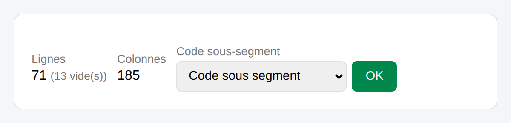
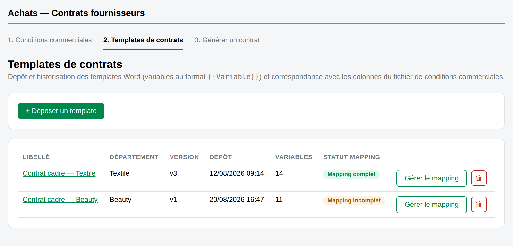
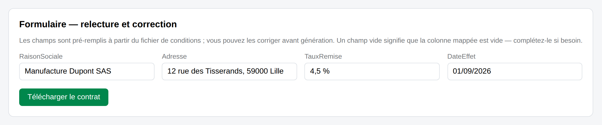

# Documentation fonctionnelle — Achats — Contrats fournisseurs

> Règles de gestion applicables à la variante SPFx de l'application (`spfx/achats-contrats`), à l'usage des
> propriétaires métier et de toute personne devant comprendre le comportement attendu sans lire le code. Les
> captures reproduisent l'interface réelle à l'identique, avec des données fictives à titre d'illustration.

## Sommaire

- [Périmètre & acteurs](#périmètre--acteurs)
- [1 · Conditions commerciales](#1--conditions-commerciales)
- [2 · Templates de contrats](#2--templates-de-contrats)
- [3 · Générer un contrat](#3--générer-un-contrat)
- [Transverse](#transverse)

## Périmètre & acteurs

L'application remplace la préparation manuelle des contrats fournisseurs : au lieu de recopier à la main les
conditions commerciales négociées dans un modèle Word, l'utilisateur recherche le code sous-segment concerné et
l'application prérempli le contrat à partir du fichier de conditions à jour.

| Acteur | Rôle métier | Accès |
|---|---|---|
| Gestionnaire conditions | Tient à jour le fichier Excel des conditions commerciales négociées. | 🟡 Propriétaires |
| Gestionnaire templates | Dépose les modèles Word et fait correspondre leurs variables aux colonnes du fichier de conditions. | 🟡 Propriétaires |
| Chargé(e) d'achats | Génère les contrats au quotidien à partir d'un code sous-segment. | 🟢 Membres |

## 1 · Conditions commerciales

🟡 *Propriétaires* — **Onglet 1**

### Règle du fichier unique

Le fichier de conditions commerciales n'a **ni version ni historique** : un seul fichier est actif à la fois, celui
utilisé pour toutes les générations de contrats.

*Le fichier peut être **déposé** (copie stockée dans SharePoint) ou **lié** (fichier externe, jamais copié) — le
badge « Lien externe » distingue les deux cas.*

**Comportement à l'ajout / remplacement**

- Un dépôt ou une liaison de fichier **remplace** immédiatement le fichier actif — aucune des deux options ne crée
  de nouvelle version côté application.
- Remplacer un fichier **déposé** supprime définitivement l'ancien fichier et son enregistrement.
- Remplacer un fichier **lié** retire uniquement le lien : le fichier d'origine, à son emplacement SharePoint,
  n'est jamais modifié ni supprimé par l'application.
- Il n'existe aucun moyen de revenir à un fichier précédent depuis l'application — c'est un choix délibéré pour
  éviter la confusion entre plusieurs versions de conditions actives.

> ⚠️ **Règle métier :** le remplacement est irréversible côté application. Toute personne devant conserver un
> historique des conditions commerciales doit le faire en dehors de l'outil (ex. archivage manuel du fichier avant
> remplacement).

### Désignation de la colonne Code sous-segment

Cette colonne du fichier sert de clé de recherche pour la génération de contrats : elle identifie la ligne de
conditions à utiliser pour un contrat donné.

*Détection automatique à l'import quand l'intitulé de colonne est reconnaissable ; sinon désignation manuelle via le
sélecteur.*

### Détection automatique des modifications

Le fichier de conditions peut continuer à être modifié après son dépôt ou sa liaison (notamment un fichier lié,
toujours édité à son emplacement d'origine). L'application ne demande **aucune action manuelle** pour prendre en
compte ces changements.

> ▸ **Règle métier :** à chaque consultation, recherche ou génération, l'application compare l'état du fichier à sa
> dernière lecture connue et recalcule automatiquement lignes, colonnes et statistiques si le fichier a changé
> depuis. L'utilisateur n'a jamais besoin de déclencher un « rafraîchissement » explicite.

## 2 · Templates de contrats

🟡 *Propriétaires* — **Onglet 2**

### Versionnement des templates

Contrairement aux conditions commerciales, les templates de contrats **conservent leur historique** : un dépôt sous
le même libellé crée une nouvelle version plutôt que de remplacer la précédente.

*Chaque dépôt d'un fichier `.docx` contenant des variables `{{Variable}}` incrémente la version (v1, v2, v3…) du
template portant ce libellé.*

- Un libellé de template identifie une **famille** de templates (ex. « Contrat cadre — Textile ») ; le département
  est une information indicative, non structurante.
- Les variables `{{Variable}}` présentes dans le document Word sont détectées automatiquement au dépôt — aucune
  saisie manuelle de la liste des variables.
- La génération d'un contrat utilise toujours la **dernière version** déposée du template choisi.

### Statuts de correspondance (mapping)

Chaque variable d'un template doit correspondre à une colonne du fichier de conditions commerciales, ou être
marquée comme saisie libre.

*Le mapping peut être renseigné ligne par ligne, ou en masse via l'export/import d'un tableur.*

| Statut | Signification | Effet à la génération |
|---|---|---|
| ✅ Mappée | La variable correspond à une colonne existante du fichier de conditions actif. | Préremplie automatiquement avec la valeur de la ligne trouvée. |
| ❌ Colonne introuvable | La variable était mappée à une colonne qui n'existe plus dans le fichier de conditions actif (ex. après remplacement du fichier). | Bloque la génération avec ce template tant que le mapping n'est pas corrigé. |
| ⚪ Saisie libre | La variable n'est volontairement liée à aucune colonne (ex. signataire, mention libre). | Jamais préremplie — laissée vide, à compléter à chaque génération. |

> ⚠️ **Règle métier :** un template avec au moins une variable en **« Colonne introuvable »** ne peut pas servir à
> générer un contrat jusqu'à ce que le mapping soit corrigé — c'est le garde-fou qui évite de générer un contrat
> avec des valeurs manquantes silencieusement.

## 3 · Générer un contrat

🟢 *Membres* — **Onglet 3**

Le point d'entrée quotidien de la majorité des utilisateurs : choisir un template, retrouver la bonne ligne de
conditions, relire les valeurs, télécharger.

### Règle de recherche

- La recherche croise le **code sous-segment** saisi avec les lignes du fichier de conditions actif.
- Si une seule ligne correspond, le formulaire de relecture s'affiche directement, préremplie selon le mapping du
  template choisi.
- Si **plusieurs lignes** correspondent (le même code apparaît plus d'une fois dans le fichier), un tableau de choix
  s'affiche pour que l'utilisateur sélectionne la bonne ligne avant la relecture.
- Si **aucune ligne** ne correspond, l'application l'indique explicitement plutôt que de générer un contrat avec
  des valeurs vides.

*Toute valeur préremplie reste modifiable avant génération — la relecture n'est jamais sautée.*

> ▸ **Règle métier :** le contrat final est toujours généré à partir des valeurs affichées dans le formulaire de
> relecture au moment du téléchargement, y compris les corrections manuelles — jamais directement depuis le fichier
> de conditions.

### Génération en lot

Quand plusieurs contrats doivent être générés pour le même template, le mode lot évite de répéter la recherche pour
chaque code.

*Chaque ligne du lot est un **code** indépendant, résolu séparément.*

- Chaque ligne saisie est recherchée indépendamment, avec le même comportement qu'une recherche unique (résolu,
  ambigu, ou introuvable).
- Une ligne résolue peut être dépliée pour relire/corriger ses valeurs avant génération, exactement comme en mode
  contrat unique.
- Au moment du téléchargement, seules les lignes **résolues** sont incluses ; les lignes introuvables ou restées
  ambiguës sont écartées et signalées dans le résumé — elles n'interrompent pas la génération des autres.
- Le résultat est un fichier `.zip` unique contenant tous les contrats générés avec succès.

> 💡 **Règle métier :** un échec partiel n'échoue jamais le lot entier — chaque ligne est traitée indépendamment, et
> l'utilisateur récupère systématiquement tout ce qui a pu être généré.

## Transverse

### Droits d'accès par onglet

L'accès aux onglets suit directement le niveau d'autorisation SharePoint de l'utilisateur sur le site — il n'existe
pas de gestion de droits propre à l'application.

| Niveau SharePoint | Rôle applicatif | Onglets visibles |
|---|---|---|
| Contrôle total | 🟡 Propriétaires | Conditions commerciales, Templates de contrats, Générer un contrat |
| Modifier | 🟢 Membres | Générer un contrat uniquement |
| Lecture (ou aucun accès) | — | Aucun onglet — l'application n'affiche aucune donnée sensible |

> ℹ️ **Règle métier :** le raisonnement est « qui peut modifier les conditions/templates doit être un propriétaire
> du site » — un membre ne peut jamais consulter ni modifier le fichier de conditions ou les templates, uniquement
> générer des contrats à partir de ce qui est déjà configuré.

### Exigences non fonctionnelles clés

- **Aucune copie silencieuse.** Un fichier lié en externe n'est jamais dupliqué dans SharePoint par l'application —
  c'est une exigence de gouvernance des données (une seule source de vérité par fichier).
- **Pas de génération avec des données incohérentes.** Un template avec une colonne mappée introuvable bloque la
  génération plutôt que de produire un contrat avec des champs vides sans avertissement.
- **Traçabilité minimale.** Chaque dépôt ou liaison de fichier de conditions enregistre qui l'a fait et quand,
  affiché dans l'onglet Conditions commerciales.
- **Résilience du lot.** Une génération en lot ne doit jamais être bloquée dans son ensemble par l'échec d'une seule
  ligne.

---

Application « Achats — Contrats fournisseurs », SharePoint (CONTRATHEQUE_GRP-PROJETCONTRATSIA2). Document à l'usage
des propriétaires métier — se référer au guide utilisateur pour le mode d'emploi pas à pas, et à la documentation
technique pour l'implémentation.
