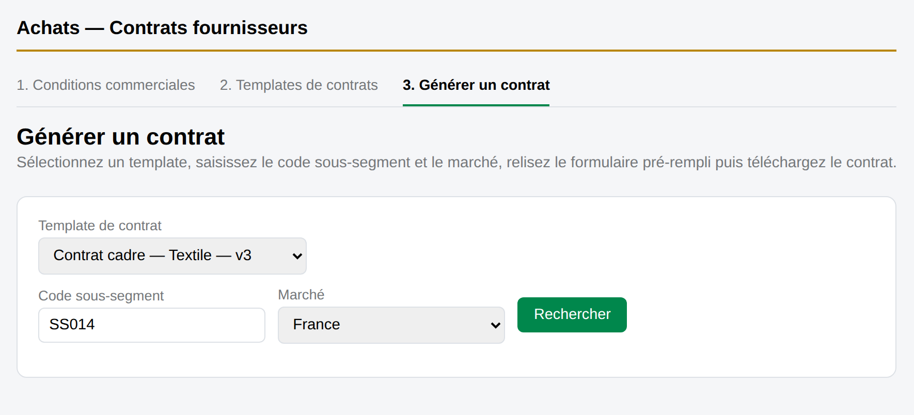
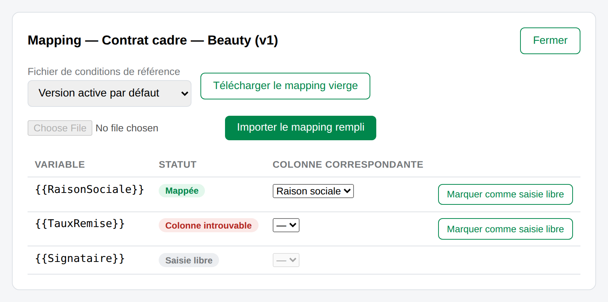

# Documentation technique — Achats — Contrats fournisseurs

> Référence d'implémentation de l'application « Achats — Contrats fournisseurs », packagée en web part SPFx
> (React + PnPjs, sans backend applicatif) — `spfx/achats-contrats`. Destinée aux développeurs amenés à faire
> évoluer ou déboguer le code. Les captures d'écran illustrent les points où le comportement technique est visible
> côté interface.

## Sommaire

- [Vue d'ensemble](#vue-densemble)
- [Structure du web part](#structure-du-web-part)
- [Accès SharePoint](#accès-sharepoint)
- [Modèle de données](#modèle-de-données)
- [Service Conditions commerciales](#service-conditions-commerciales)
- [Service Templates](#service-templates)
- [Service de génération](#service-de-génération)
- [Provisioning & schéma](#provisioning--schéma)
- [Permissions](#permissions)
- [Cache (LRU)](#cache-lru)
- [Journalisation des erreurs](#journalisation-des-erreurs)
- [Lecture des fichiers Excel](#lecture-des-fichiers-excel)
- [Écart avec la version standalone](#écart-avec-la-version-standalone-nodereact)

## Vue d'ensemble

L'application n'a pas de serveur applicatif : tout s'exécute dans le navigateur, à l'intérieur du web part, et parle
directement à SharePoint via [PnPjs](https://pnp.github.io/pnpjs/). SharePoint joue le rôle de base de données
(listes) et de système de fichiers (bibliothèques de documents).

| Couche | Rôle | Fichiers clés |
|---|---|---|
| Web part | Point d'entrée SPFx, monte le composant React racine | `AchatsContratsWebPart.ts` |
| Composants React | UI Fluent UI, un composant par onglet | `components/*.tsx` |
| Services | Logique métier et accès SharePoint, sans état React | `services/*.ts` |
| Modèle | Types partagés entre services et composants | `model/types.ts` |
| SharePoint | Persistance : listes génériques + bibliothèques de documents | — |

## Structure du web part

`AchatsContratsWebPart.ts` est une classe `BaseClientSideWebPart<IAchatsContratsWebPartProps>` minimale :
`IAchatsContratsWebPartProps` ne porte qu'un champ `description` jamais utilisé, et
`getPropertyPaneConfiguration()` retourne `{ pages: [] }` — aucun panneau de propriétés, car tout est
auto-provisionné au premier chargement (voir [Provisioning](#provisioning--schéma)). `render()` fait un
`React.createElement(AchatsContrats, { context: this.context })` ; `onDispose()` démonte le composant.
`IAchatsContratsProps` ne transmet que `{ context: WebPartContext }` au composant racine.

### Composant racine `AchatsContrats.tsx`

Au montage : `getSP(props.context)` initialise PnPjs, puis `ensureProvisioned()`, puis `getAppPermissions()`
détermine `isOwner` / `canGenerate`. Un `Spinner` Fluent UI s'affiche pendant le chargement ; un bandeau d'erreur si
le provisionnement échoue ; un message de refus d'accès si l'utilisateur n'a ni `isOwner` ni `canGenerate`.

*Le `Pivot` Fluent UI n'affiche que les onglets autorisés : « Conditions commerciales » et « Templates de contrats »
sont réservés à `isOwner`, « Générer un contrat » à `canGenerate` (qui inclut `isOwner`).*

Un `refreshKey` incrémenté à chaque changement d'onglet force le remontage de `TemplatesTab`/`GenerateTab` — il
n'existe pas de store partagé entre onglets, chacun recharge ses propres données au montage. L'onglet de démarrage
dépend des droits : `isOwner ? 'conditions' : canGenerate ? 'generer' : null`. `initializeIcons()` (Fluent UI) est
appelé une seule fois au chargement du module, hors composant, pour que les icônes des boutons (édition,
suppression, ajout) s'affichent correctement.

## Accès SharePoint

`spClient.ts` expose une fonction unique `getSP(context?)` qui construit et mémoïse une instance PnPjs `SPFI` via
`spfi().using(SPFx(context))`. Le contexte du web part porte l'authentification héritée de SharePoint — aucune
gestion manuelle de jeton. `getSP()` est appelé une première fois avec le contexte (dans `AchatsContrats.tsx`), puis
sans argument depuis tous les services. Les requêtes passent par les modules PnPjs `@pnp/sp/webs`, `/lists`,
`/items`, `/files`, `/files/folder`, `/folders`, `/fields`, `/site-users/web`, `/security/web`.

`odata.ts` fournit `odataEscape(value)`, qui double les guillemets simples avant interpolation dans un filtre
OData.

> ⚠️ Nécessaire même pour des valeurs a priori sûres : le code s'exécute entièrement côté navigateur et est donc
> modifiable depuis la console par n'importe quel utilisateur connecté — un filtre OData mal échappé est une
> surface d'injection.

`storage.ts` utilise en plus un point d'entrée bas niveau (`SPQueryable`/`spGet` de `@pnp/queryable`/
`@pnp/sp/spqueryable`) pour appeler `getWebUrlFromPageUrl`, une méthode SharePoint non modélisée par les types
PnPjs haut niveau, utilisée pour résoudre le site propriétaire d'un fichier lié situé sur un autre site ou
sous-site.

## Modèle de données

`model/types.ts` est explicitement porté depuis `server/src/db.ts` (version standalone) ; les identifiants
numériques SharePoint sont convertis en `string` pour rester compatibles avec le code d'origine, qui manipulait des
uuid v4.

| Type | Champs / rôle |
|---|---|
| `ConditionsVersion` | `id, nomFichier, dateDepot, cheminStockage, colonnes[], colonneCodeSousSegment, colonneMarche, estActive, deposePar, nbLignes, nbLignesVides, nbColonnes, doublonsDetectes, archive, externe` — `externe` marque un fichier lié (jamais copié). |
| `MappingStatut` | `'mappee' \| 'libre' \| 'manquante'` |
| `MappingLine` | `variable, colonneCorrespondante, statut, colonneIntrouvable?` — `colonneIntrouvable` calculé côté client. |
| `Template` | `id, groupId, libelle, departement, dateDepot, version, nomFichier, cheminStockage, variables[], deposePar, archive, mappings[], statutMapping` (`'complet'\|'incomplet'\|'absent'`) |
| `GenerateTemplateOption` | Version allégée pour l'écran de génération : `id, libelle, departement, version, mappingComplet` |
| `SearchMatch` | `{ rowIndex, preview: Record<string,string> }` |
| `GenerationLog` | Journal d'audit : `templateId, templateLibelle, conditionsVersionId, conditionsNomFichier, codeSousSegment, dateGeneration, traitePar` |

## Service Conditions commerciales

`conditionsService.ts`. Le fichier courant est stocké dans la liste `ConditionsVersions` ; les fichiers déposés vont
dans la bibliothèque `ConditionsFichiers`. Le modèle sous-jacent gère historiquement un multi-versions
(`estActive`, `archive`), mais l'écran `ConditionsTab` impose la règle « un seul fichier courant » :
`replaceConditionsWithUpload` et `replaceConditionsWithLink` appellent `deleteAllConditions()` (supprime tous les
éléments existants — sauf les fichiers en lien externe, jamais supprimés physiquement) avant de créer la nouvelle
version.

### Lien externe vs dépôt

`linkExternalConditions(reference, deposePar)` ne copie jamais le fichier : il résout la référence via
`resolveFileReference` (dans `storage.ts`, gère lien de partage court `?d=...`, lien `sourcedoc=GUID`, URL absolue,
chemin relatif, y compris cross-site via `getWebUrlFromPageUrl`), puis enregistre `Externe: true` et
`CheminStockage` pointant vers l'emplacement d'origine. `deleteConditions` ne supprime le fichier physique que si
`!version.externe`.

*Le badge **« Lien externe »** reflète directement le champ `Externe` de la liste `ConditionsVersions` — c'est le
seul indicateur visuel de la distinction dépôt/lien.*

### Détection des colonnes

Réalisée dans `excel.ts` (`parseConditionsFile`), qui retourne `colonneCodeCandidate`/`colonneMarcheCandidate` par
heuristique de libellés (`CODE_HEADER_HINTS`, `MARCHE_HEADER_HINTS` + regex de repli), avec `shortestMatch`
préférant l'en-tête le plus court en cas d'ambiguïté (pour éviter de matcher un texte d'aide long contenant
accidentellement le mot recherché). `setConditionsCodeColumn` / `setConditionsMarcheColumn` permettent une
désignation manuelle, validée contre `version.colonnes`.

### Resynchronisation automatique

`resyncIfFileChanged(item)` compare `FichierModifieLe` (stocké) à la valeur courante lue via `getFileModified`. Si
différente : retélécharge et reparse le fichier, recalcule `Colonnes / ColonneCodeSousSegment / ColonneMarche /
NbLignes / NbLignesVides / NbColonnes / DoublonsDetectes / FichierModifieLe`, invalide `rowsCache`, et persiste via
`list().items.getById(item.Id).update(patch)`. Déclenché à chaque `getConditionsVersion(id)`. En cas d'échec de
resync, l'élément d'origine (potentiellement périmé) est retourné sans bloquer l'appelant.

> ℹ️ Autres points : `reconcileSingleActive()` rattrape le cas de deux versions `EstActive=1` simultanées (pas de
> transaction côté SharePoint) ; `archiveConditions` / `deleteConditions` refusent d'agir sur la version active ;
> `readConditionsRows` met en cache les lignes parsées via `rowsCache` (LRU, taille 10).

## Service Templates

`templatesService.ts` + `docx.ts`. Stockage : liste `TemplatesContrats` (`GroupId / Libelle / Departement /
DateDepot / Version / NomFichier / CheminStockage / Variables / DeposePar / Archive / FichierModifieLe`) +
bibliothèque `TemplatesFichiers` pour les `.docx` + liste `MappingsTemplate` (`TemplateId / Variable /
ColonneCorrespondante / Statut`).

### Versionnement

Chaque dépôt sous un même `groupId` incrémente `Version` (`previousVersions.reduce(max) + 1`) ; `listTemplates()`
ne garde que la dernière version non archivée par `GroupId` (`latestByGroup`). Un nouveau `groupId`
(`crypto.randomUUID()`) est créé si non fourni.

### Détection des variables `{{Variable}}`

`docx.ts` (`extractVariablesFromDocx`) travaille directement sur `word/document.xml` via `JSZip`, en reconstituant
le texte logique concaténé de tous les runs `<w:t>` — nécessaire pour retrouver des variables coupées entre
plusieurs runs Word — puis matche `VARIABLE_PATTERN = /\{\{\s*([^{}]+?)\s*\}\}/g`. `fillDocxTemplate` remplace
ensuite chaque occurrence dans les runs concernés en préservant la mise en forme XML.

### Mapping

À chaque dépôt de template, une ligne `MappingsTemplate` (`Statut: 'manquante'`) est créée par variable détectée.
Le statut global `Template.statutMapping` est calculé par `computeStatutMapping` / `ligneValide` : une ligne
`mappee` n'est valide que si sa `ColonneCorrespondante` existe encore dans le référentiel de colonnes actif — sinon
marquée `colonneIntrouvable`.

*Le badge **« Colonne introuvable »** matérialise `colonneIntrouvable: true` — recalculé côté client à chaque
affichage contre le référentiel de colonnes du fichier de conditions actif, pas persisté tel quel.*

Import de mapping via un fichier Excel (`parseMappingFile`, colonnes A=Variable / B=Colonne), avec détection de
variables inconnues, doublons et colonnes hors référentiel (`importMapping`), et export d'un classeur vierge avec
liste déroulante de validation (`buildBlankMappingWorkbook`).

Resync auto (analogue aux conditions) : `resyncTemplateIfFileChanged` compare `FichierModifieLe`, recalcule
`variables` via `extractVariablesFromDocx` si le `.docx` a été modifié directement dans la bibliothèque, ajoute des
lignes de mapping `manquante` pour les variables apparues, supprime celles des variables disparues.

## Service de génération

`generateService.ts`. `searchCode(conditionsVersionId, code, marche?)` recherche dans les lignes du fichier de
conditions (`readConditionsRows`) par égalité insensible à la casse/aux espaces sur `colonneCodeSousSegment` ; si le
fichier désigne une `colonneMarche`, filtre en plus sur le marché (alors obligatoire — sinon erreur explicite).
Retourne un tableau de `SearchMatch` (peut contenir plusieurs lignes ambiguës). `listMarches(conditionsVersionId)`
liste les valeurs distinctes triées de la colonne marché, pour peupler le sélecteur.

`getMappedValues(conditionsVersionId, templateId, rowIndex)` résout, pour chaque `MappingLine` du template, la
valeur de la colonne correspondante sur la ligne choisie (convention « zéro interprétation » : colonne vide → champ
vide), et remonte `colonnesManquantes` si une colonne mappée n'existe plus.

`generateContract(params)` (contrat unique) résout template + version puis délègue à `generateContractResolved` :
télécharge le `.docx` (`downloadTemplateFile`, mis en cache), appelle `fillDocxTemplate`, journalise l'action dans
la liste `Generations`, et produit un `Blob` nommé `{nomFichierSansExt}_{codeSousSegment}.docx`.

`generateContractsBatch(items, onProgress?)` (lot) résout template/version une seule fois par paire
`(templateId, conditionsVersionId)` (cache mémoire local à l'appel), traite chaque code en `try/catch` isolé — un
échec n'arrête pas le lot, collecté dans `erreurs` — gère les collisions de nom de fichier, et regroupe le tout dans
une archive `JSZip` téléchargée sous `contrats_{timestampTag()}.zip`. `onProgress(done, total)` alimente l'affichage
de progression côté `GenerateTab`.

*La ligne « Introuvable » vient d'un `SearchMatch[]` vide pour ce code — elle est simplement absente du ZIP final,
sans faire échouer le reste du lot.*

## Provisioning & schéma

`provisioning.ts`. `doProvision()` crée/complète, via `sp.web.lists.ensure(nom, description, template)`, quatre
listes génériques (`GENERIC_LIST_TEMPLATE = 100`) — `ConditionsVersions`, `TemplatesContrats`, `MappingsTemplate`,
`Generations` — et deux bibliothèques de documents (`DOCUMENT_LIBRARY_TEMPLATE = 101`) — `ConditionsFichiers`,
`TemplatesFichiers` — chacune avec ses champs ajoutés via `ensureField()` (qui avale silencieusement une erreur
« champ déjà existant », journalisée en `console.warn`).

`ensureProvisioned()` est mémoïsé en mémoire pour la durée de vie de la page, avec un repli `localStorage` (clé
`achats-contrats-provisioned-v{SCHEMA_VERSION}:{webUrl}`) pour éviter de rejouer l'intégralité de la routine (une
demi-douzaine de `lists.ensure` et une trentaine d'ajouts de champs) à chaque rechargement de page.

> ⚠️ `SCHEMA_VERSION = 3` doit être incrémentée à chaque nouveau champ ou liste ajouté dans `doProvision()` — sinon
> les sites déjà provisionnés avant cette date ne recevront jamais le nouveau champ. Incident réel cité en
> commentaire : le champ `FichierModifieLe` (v1.0.18) ajouté sans bump de version.

Après un provisionnement effectif (pas depuis le cache), un délai fixe de 3 secondes est observé pour laisser
SharePoint propager les métadonnées avant la première lecture. `withListRecovery(fn)` détecte le message d'erreur
SharePoint « la liste n'existe pas » (FR/EN), oublie le provisionnement mémorisé (`forgetProvisioning`, y compris
le flag `localStorage`), relance `ensureProvisioned()` et retente une seule fois. `retryOnce` / `retryUntilValid`
gèrent respectivement les erreurs transitoires post-écriture et les lectures « réussies mais incomplètes » (délais
croissants 1,5 s / 3 s, jusqu'à 3 tentatives).

## Permissions

`permissions.ts`. Le contrôle se fait par **niveau d'autorisation SharePoint** (`PermissionKind`, module
`@pnp/sp/security`), pas par nom de groupe — les groupes par défaut peuvent être renommés ou remplacés (AD / Entra
ID). `computePermissions()` appelle `web.currentUserHasPermissions(PermissionKind.ManageWeb)` (→ `isOwner`,
typiquement Propriétaires / Contrôle total) et `PermissionKind.AddListItems` (→ contribue à `canGenerate`,
typiquement Membres). `canGenerate = isOwner || canAddItems`. Le résultat est mémoïsé pour la session.

> ℹ️ Ce contrôle ne masque que l'UI du web part — pas les listes SharePoint sous-jacentes. Ce n'est pas une mesure
> de sécurité au niveau des données : la protection réelle des listes/bibliothèques reste celle configurée
> nativement sur le site SharePoint.

## Cache (LRU)

`lruCache.ts`. `LruCache<K,V>` est un cache borné minimal basé sur une `Map` (ordre d'insertion réutilisé comme
ordre LRU par suppression/réinsertion à chaque `get`/`set`). Deux instances de module (portée dépassant le cycle de
vie React) : `rowsCache` dans `conditionsService.ts` (lignes Excel parsées, taille 10) et `templateFileCache` dans
`templatesService.ts` (buffers `.docx` téléchargés, taille 10). But : éviter une dérive mémoire progressive sur une
session longue où plusieurs dizaines de versions/templates sont consultées, chacune accumulant sinon en mémoire son
fichier entier sans jamais être libéré.

## Journalisation des erreurs

`errorLog.ts` expose une fonction unique `logAndGetMessage(e, context)` : journalise l'erreur complète via
`console.error('[achats-contrats] Erreur dans ${context} :', e)` (préserve la pile d'appel, sinon invisible car
interceptée par les `try/catch` React des composants), puis retourne `e.message` (si `Error`) ou `String(e)`,
affiché dans les bandeaux `alert error` des composants. Convention : `context` identifie précisément l'action (ex.
`"ConditionsTab.refresh"`, `"GenerateTab.runBatchSearch"`).

## Lecture des fichiers Excel

`excel.ts` utilise [ExcelJS](https://github.com/exceljs/exceljs) (porté depuis `server/src/utils/excel.ts`,
fonctionne en navigateur sur un `ArrayBuffer`). `parseConditionsFile(buffer)` :

- `choisirFeuille` sélectionne la feuille contenant une cellule `Actif`/`Inactif` (`STATUT_RE`), sinon la plus
  volumineuse (score `hasStatut * 1e9 + rowCount*columnCount`).
- `sheetToMatrix` convertit la feuille en matrice de chaînes en propageant les valeurs des cellules fusionnées.
- Repère `dataStart` (première ligne portant le statut Actif/Inactif, ou repli sur densité de cellules), reconstruit
  les en-têtes en concaténant jusqu'à 8 lignes précédentes (`headerRows`), en filtrant les libellés génériques
  d'instruction (`LIBELLE_GENERIQUE_RE` : « AUTO » / « SAISIE » / « MENU DEROULANT »).
- **Lignes vides** : toute ligne sans aucune valeur non vide dans les colonnes détectées est comptée dans
  `nbLignesVides` et exclue de `rows`.
- **Doublons** : `findDuplicateCodes(rows, colonneCode)` compare les valeurs normalisées (trim + minuscule) de la
  colonne code et compte les clés apparaissant plus d'une fois.

`buildBlankMappingWorkbook` génère un classeur de mapping vierge avec liste déroulante de validation (repli sur une
feuille auxiliaire masquée `ListeColonnes` si la formule inline dépasse 255 caractères). `parseMappingFile` relit
un mapping rempli (colonne A=Variable, B=Colonne, à partir de la ligne 2).

## Écart avec la version standalone Node/React

Le dépôt contient également des dossiers `client/` (React + Vite) et `server/` (API applicative) au même niveau que
`spfx/` — une variante indépendante de l'application. Plusieurs commentaires du code SPFx référencent explicitement
ce portage (« porté depuis `server/src/db.ts` », « porté tel quel depuis `server/src/utils/excel.ts` »).

| Aspect | Standalone (client/server) | SPFx |
|---|---|---|
| Persistance | Stockage JSON local côté serveur (`db.ts` / `jsonStore.ts`) | Listes & bibliothèques SharePoint, auto-provisionnées côté client |
| API | API REST Express (`server/src/routes/*.ts`), consommée via `client/src/api.ts` | Aucun serveur applicatif — la logique métier des routes est portée directement dans les services TypeScript exécutés dans le navigateur |
| Authentification | Modèle propre au serveur standalone | Héritée entièrement du contexte SharePoint (`SPFx(context)`), sans gestion de jeton |

> ℹ️ Une comparaison ligne à ligne complète nécessiterait de relire `server/src/index.ts`,
> `server/src/routes/*.ts` et `client/src/api.ts`/`App.tsx` — hors périmètre de cette synthèse.

---

Application « Achats — Contrats fournisseurs », web part SPFx (React + PnPjs). Document à l'usage des développeurs
— se référer à la documentation fonctionnelle pour les règles de gestion, et au guide utilisateur pour le mode
d'emploi.
