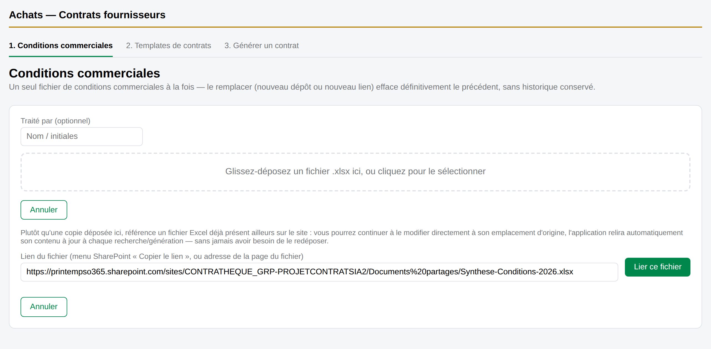

# Guide utilisateur — Achats — Contrats fournisseurs

> Ce guide décrit l'application « Achats — Contrats fournisseurs » (variante SPFx, `spfx/achats-contrats`), son
> fonctionnement à travers ses trois onglets, et qui peut faire quoi. Les captures ci-dessous reproduisent
> l'interface réelle à l'identique (mêmes libellés, mêmes couleurs), avec des données fictives à titre
> d'illustration.

## Sommaire

- [Aperçu & droits d'accès](#aperçu--droits-daccès)
- [1 · Conditions commerciales](#1--conditions-commerciales)
  - [Consulter le fichier courant](#consulter-le-fichier-courant)
  - [Déposer ou lier un fichier](#déposer-ou-lier-un-fichier)
  - [Désigner la colonne Code sous-segment](#désigner-la-colonne-code-sous-segment)
- [2 · Templates de contrats](#2--templates-de-contrats)
  - [Déposer un template](#déposer-un-template)
  - [Faire correspondre chaque variable à une colonne](#faire-correspondre-chaque-variable-à-une-colonne)
- [3 · Générer un contrat](#3--générer-un-contrat)
  - [Un seul contrat](#un-seul-contrat)
  - [Générer plusieurs contrats à la fois](#générer-plusieurs-contrats-à-la-fois)
- [Questions fréquentes](#questions-fréquentes)

## Aperçu & droits d'accès

L'application s'organise en trois étapes successives. Ce que vous voyez dépend de votre niveau d'accès au site
SharePoint.

| Rôle | Onglets visibles |
|---|---|
| 🟡 **Propriétaires** | Conditions commerciales, Templates de contrats, et Générer un contrat |
| 🟢 **Membres** | Générer un contrat uniquement |

1. **Conditions commerciales** — le fichier Excel qui contient les données par code sous-segment utilisées pour
   préremplir un contrat.
2. **Templates de contrats** — les modèles Word (avec des variables `{{Variable}}`) et leur correspondance avec les
   colonnes du fichier de conditions.
3. **Générer un contrat** — la recherche d'un code, la relecture des valeurs, puis le téléchargement du contrat
   rempli.

> ℹ️ Si vous n'avez accès qu'à un seul onglet, ou à aucun, contactez un propriétaire du site — l'accès se base sur
> votre niveau d'autorisation SharePoint (Contrôle total pour les deux premiers onglets, Modifier pour le
> troisième).

## 1 · Conditions commerciales

🟡 *Propriétaires* — **Onglet 1**

Un seul fichier de conditions à la fois — pas d'historique de versions. Le remplacer efface définitivement le
précédent.

### Consulter le fichier courant

- Le fichier courant, jamais copié pour un lien externe.
- « Changer de fichier » remplace définitivement (dépôt ou nouveau lien).
- Statistiques du fichier (lignes, colonnes, vides).
- La colonne désignée, modifiable via le crayon ✎.

### Déposer ou lier un fichier

Cliquez sur **« Changer de fichier »** (ou, si aucun fichier n'est encore configuré, le formulaire s'affiche
directement). Deux façons de fournir le fichier :

1. **Déposer une copie** — glissez-déposez un `.xlsx`, ou cliquez pour le sélectionner.
2. **Lier un fichier déjà existant ailleurs sur le site** — cliquez sur « Lier un fichier existant plutôt qu'en
   déposer un », puis collez le lien du fichier (menu SharePoint « Copier le lien », ou l'adresse de la page quand
   le fichier est ouvert). Le fichier n'est jamais copié : vous continuez à l'éditer à son emplacement d'origine, et
   l'application relit son contenu à jour automatiquement.

*Le champ de lien accepte un « Copier le lien » SharePoint ou l'adresse de la page ouverte du fichier.*

> ⚠️ Remplacer le fichier est **irréversible** : l'ancien fichier (et son enregistrement) est définitivement
> supprimé — sauf s'il s'agissait d'un lien externe, où seul le lien est retiré, jamais le fichier d'origine.

### Désigner la colonne Code sous-segment

Cette colonne sert à retrouver la bonne ligne lors de la génération d'un contrat. Elle est détectée automatiquement
à l'import quand un intitulé de colonne l'évoque clairement ; sinon (ou pour corriger une détection erronée),
cliquez sur le crayon ✎ à côté du nom de colonne, choisissez la bonne colonne dans la liste, puis **OK**.

*Le sélecteur liste toutes les colonnes du fichier ; « OK » valide le choix.*

## 2 · Templates de contrats

🟡 *Propriétaires* — **Onglet 2**

Les modèles Word à remplir, avec leurs variables au format `{{Variable}}`, et la correspondance de chaque variable
avec une colonne du fichier de conditions.

### Déposer un template

*Un dépôt du même libellé crée une **nouvelle version** (v1, v2, v3…) — l'historique est conservé ici,
contrairement aux conditions commerciales.*

Pour déposer un template : cliquez sur **« + Déposer un template »**, renseignez un libellé (obligatoire), un
département (optionnel), puis sélectionnez le fichier `.docx`. Les variables `{{Variable}}` qu'il contient sont
détectées automatiquement au dépôt.

### Faire correspondre chaque variable à une colonne

Cliquez sur **« Gérer le mapping »** sur la ligne du template concerné.

Chaque variable est **Mappée** (colonne choisie), **Manquante** (rien de choisi), ou **Saisie libre** (jamais
préremplie — à taper à la main à chaque contrat). Une colonne mappée qui n'existe plus dans le fichier de conditions
actif apparaît en **« Colonne introuvable »** : à corriger avant de pouvoir générer un contrat avec ce template.

Deux façons de faire correspondre les variables : les assigner une par une dans le tableau, ou **télécharger le
mapping vierge** (un tableur avec la liste des variables et des colonnes disponibles), le remplir, puis
l'**importer** — pratique pour un template avec beaucoup de variables.

## 3 · Générer un contrat

🟢 *Membres* — **Onglet 3**

Recherchez un code sous-segment, relisez les valeurs préremplies, téléchargez.

### Un seul contrat

*Si plusieurs lignes correspondent au code saisi, un tableau de choix s'affiche avant le formulaire.*

*Les champs sont pré-remplis à partir du fichier de conditions ; corrigez-les si besoin avant de télécharger.*

### Générer plusieurs contrats à la fois

Cochez **« Générer plusieurs contrats à la fois »** : le champ unique devient une liste de lignes, une par contrat.

Chaque ligne devient un **code** à rechercher. Après « Rechercher tout », dépliez une ligne résolue pour en
relire/corriger les valeurs, comme pour un contrat unique. Un code introuvable ou resté ambigu est ignoré au
téléchargement final — le résumé l'indique. Tous les contrats réussis sont regroupés dans un seul fichier `.zip`.

## Questions fréquentes

**Je modifie le fichier de conditions, mes changements sont-ils pris en compte ?**
Oui, automatiquement — que le fichier soit déposé ou lié en externe. L'application détecte que le fichier a changé
à chaque recherche/génération et recalcule colonnes et statistiques toute seule, sans qu'aucune action ne soit
nécessaire de votre part.

**Le lien que je colle dans « Lier un fichier existant » n'est pas trouvé.**
Vérifiez qu'il pointe vers le fichier lui-même : ouvrez-le dans SharePoint puis utilisez « Copier le lien », ou
collez l'adresse affichée dans la barre du navigateur quand le fichier est ouvert. Un lien vers un dossier ou une
page d'accueil ne fonctionnera pas.

**Le menu déroulant d'une colonne est illisible / le bouton OK est invisible.**
Cela arrive si le fichier contient un intitulé de colonne anormalement long (souvent un texte d'aide concatené par
erreur). Élargissez la fenêtre du navigateur, ou survolez l'option pour lire son intitulé complet en infobulle avant
de la choisir.

**Pourquoi je ne vois pas les onglets Conditions commerciales et Templates de contrats ?**
Ces deux onglets sont réservés aux **propriétaires** du site (niveau Contrôle total). Un membre (niveau Modifier)
n'a accès qu'à « Générer un contrat ». Demandez à un propriétaire du site de vous accorder ce niveau si vous en avez
besoin.

---

Application « Achats — Contrats fournisseurs », SharePoint (CONTRATHEQUE_GRP-PROJETCONTRATSIA2). Les captures de ce
guide reproduisent l'interface réelle à l'identique (mêmes composants, mêmes styles) avec des données fictives à
titre d'illustration.
